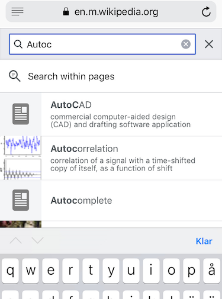

# Lab 2: Autocomplete

In this lab, you will implement autocompletion for a given set of terms.
A term consists of a string and an associated non-negative weight.
Given a prefix string, the job of the autocompleter is to efficiently all terms that start with this string and list them in descending order of weight.

## About the labs

- The lab is part of the examination of the course. Therefore, you must not copy code from or show code to other groups. You are welcome to discuss ideas with one another, but anything you do must be **the work of you and your lab partners**.
- Please read the pages "Doing the lab assignments" and "Running the labs" on Canvas.

## Getting started

The lab files contains the following classes:

- **Term.java**: autocompletion terms
- **RangeBinarySearch.java**: two different binary search algorithms
- **Autocompleter.java**: the autocompletion engine
- **AutocompleteCLI.java**: a command-line interface to the autocompleter (should not be changed)
- **AutocompleteGUI.java**: a graphical interface to the autocompleter (should not be changed)
- **ParsedInput.java**: a helper class for parsing program arguments (should not be changed)

as well as a directory of **dictionaries**, and a file **answers.txt** where you will write down answers to questions in the lab.

You should be able to compile all files, but when you try to run them you will get a runtime error:

```
$ javac AutocompleteCLI.java

$ java AutocompleteCLI dictionaries/romaner.txt 5
Loaded dictionary dictionaries/romaner.txt containing 83334 words
Maximum number of matches to display: 5

Exception in thread "main" java.lang.UnsupportedOperationException
(...)
```

## Background

Autocomplete is pervasive in modern applications. As the user types, the program predicts the complete query (typically a word or phrase) that the user intends to type. Autocomplete is most effective when there are a limited number of likely queries. For example, Wikipedia uses it to display matching page titles as the user types; search engines use it to display suggestions; cell phones use it to speed up text input.

| Wikipedia search | Web search | SMS suggestions |
|------------------|------------|-----------------|
|  |  |  |

In these examples, the application predicts how likely it is that the user is typing each query and presents to the user a list of the top-matching queries, in descending order of weight. These weights are determined by historical data, such as box office revenue for movies, frequencies of search queries from other Google users, or the typing history of a cell phone user. For the purposes of this assignment, you will have access to a set of all possible queries and associated weights (and these queries and weights will not change).

The performance of autocomplete functionality is critical in many systems. For example, consider a search engine which runs an autocomplete application on a server farm. According to one study, the application has only about 50ms to return a list of suggestions for it to be useful to the user. Moreover, in principle, it must perform this computation for every keystroke typed into the search bar and for every user!

In this assignment, you will implement autocomplete by (1) sorting the terms alphabetically; (2) binary searching to find all query strings that start with a given prefix; and (3) sorting the matching terms by weight.

## Part 1: The autocompletion term

The class `Term` represents an autocompletion term: a string and an associated integer weight. Extend it with the following static attributes and methods, which support comparing terms by three different orders:

- [case-insensitive lexicographic order](https://docs.oracle.com/javase/8/docs/api/java/lang/String.html#compareToIgnoreCase-java.lang.String-);
- in descending order by weight; and
- case-insensitive lexicographic order, but using only the first *k* characters – this order may seem a bit odd, but you will use it in Part 3 to find all words that start with a given prefix (of length *k*)

```java
public class Term:
    ...
    // Compares two terms in case-insensitive lexicographic order.
    public static final Comparator<Term> byLexicographicOrder

    // Compares two terms in descending order by weight.
    public static final Comparator<Term> byReverseWeightOrder

    // This method returns a comparator that compares the two terms in case-insensitive
    // lexicographic order, but using only the first k characters of each word.
    public static Comparator<Term> byPrefixOrder(int k)
```

There is also an additional method `getPrefix` that you can implement, which might be of help when defining the `byPrefixOrder` comparator.

To get case-insensitive lexicographic order, you should use the String method `.compareToIgnoreCase(…)`.
The [course book, chapter 1](https://chalmersgu-data-structure-courses.github.io/OpenDSA/Published/ChalmersGU-DSABook/), contains some explanations of the concept of comparators.

### Performance requirements

- The string comparison functions should have linear complexity, O(*N*), in the number of characters *N* needed to resolve the comparison.

### Testing the Term class

There are some tests in the static `main` method. When you have implemented your comparators, you should be able to compile the file and run it. However, note that these tests do not prove that your implementation is correct!

## Part 2: Binary search for a range

When binary searching a sorted array that contains more than one key equal to the search key, the client may want to know the index of either the first or the last such key. Accordingly, implement modified versions of binary search in the class `RangeBinarySearch` with the following API:

```java
public class RangeBinarySearch:
    // Returns the index of the *first* element in `a` that equals the search key,
    // according to the given comparator, or -1 if there is no matching element.
    // Precondition: `a` is sorted according to the given comparator.
    // Complexity: O(log N) comparisons where N is the length of `a`
    public static<T> int firstIndexOf(T[] a, T key, Comparator<T> comparator)

    // Returns the index of the *last* element in `a` that equals the search key,
    // according to the given comparator, or -1 if there are is matching element.
    // Precondition: `a` is sorted according to the given comparator.
    // Complexity: O(log N) comparisons where N is the length of `a`
    public static<T> int lastIndexOf(T[] a, T key, Comparator<T> comparator)
```
These methods are *generic* in the type `T` of the array elements.
That means they can be called for any type `T`, be it numbers, strings, or terms.
Therefore, when writing these methods, you are forced to treat `T` as a black box.

***Note 1***: You must not solve this by first implementing a generic binary search, and then doing a linear search to find the first/last matching element! (Example: if you search for the prefix "e" on the `gp2011` dictionary, you will get 34219 matches, and you don't want to search through all these just to get to the first/last match).

***Note 2***: Don't call `Arrays.binarySearch(…)` from `java.util` – you have to implement your own binary search!

***Note 3***: We consider values `a` and `b` of type `T` are equal if `comparator.compare(a, b)` returns `0` – not if `a.equals(b)` or `a == b` (reference equality).

### Performance requirements

- The methods `.firstIndexOf(…)` and `.lastIndexOf(…)` should have logarithmic comparison complexity in the array length.
- In this context, a comparison is one call to `comparator.compare(…)`.


### Testing your implementation

We suggest that you come up with some tests that you can run on your binary search functions, and test them before moving on to the next part. You can e.g. put them in the static `main` method, and then you can compile and run the program.

## Part 3: Autocompletion

In this part, you will implement a data type that provides autocomplete functionality for a given set of string and weights, using `Term` and `RangeBinarySearch`. To do so, (i) sort the terms in lexicographic order; (ii) use binary search to find all terms that start with a given prefix; and (iii) sort the matching terms in descending order by weight. Organize your program by implementing the following API in the class `Autocompleter`:

```java
public class Autocompleter:
    private Term[] dictionary

    // Initializes the dictionary from the given array of terms.
    public Autocompleter(Term[] dictionary):
        this.dictionary = dictionary
        sortDictionary()

    // Sorts the dictionary in *case-insensitive* lexicographic order.
    // Complexity: O(N log N) where N is the number of dictionary terms
    private void sortDictionary()

    // Returns the number of terms that start with the given prefix.
    // Precondition: the internal dictionary is in lexicographic order.
    // Complexity: O(log N) where N is the number of dictionary terms
    public int numberOfMatches(String prefix)

    // Returns all terms that start with the given prefix, in descending order of weight.
    // Precondition: the internal dictionary is in lexicographic order.
    // Complexity: O(log N + M log M) where M is the number of matching terms
    public Term[] allMatches(String prefix)
```

***Note***: You don't have to implement the sorting algorithm by yourself – instead you can use the Java library's method `Arrays.sort`. You may assume that this method performs O(*N* log(*N*)) comparisons in the length *N* of the input array.

### Performance requirements

- The method `.sortDictionary()` should make proportional to *N* log(*N*) comparisons (or better) in the worst case, where *N* is the number of terms.
- The method `.allMatches(…)` should make proportional to log *N* + *M* log(*M*) comparisons (or better) in the worst case, where *M* is the number of matching terms.
- The method `.numberOfMatches(…)` should make proportional to log(*N*) comparisons (or better) in the worst case. It should not depend on *M*.
- In this context, a *comparison* is one call to the `.compare(…)` method provided by any of the comparators defined in `Term`.

## Input format

We provide a number of sample input files for testing. Each file consists of a number of pairs of strings and non-negative weights. There is one pair per line, with the weight and string separated by whitespace. A weight can be any integer between 0 and 2<sup>63</sup>−1. The string can be an arbitrary sequence of Unicode characters, including spaces (but not newlines, and no spaces at the end).

- **wiktionary.txt** contains the 10,000 most common words in Project Gutenberg, with weights proportional to their frequencies.

  ```
    5627187200  the
    3395006400  of
    2994418400  and
    2595609600  to
                ...
    392402      wench
    392323      calves
  ```

- **cities.txt** contains 93,827 cities, with weights equal to their populations.

  ```
      14608512  Shanghai, China
      13076300  Buenos Aires, Argentina
      12691836  Mumbai, India
      12294193  Mexico City, Distrito Federal, Mexico
                ...
      2         Grytviken, South Georgia and The South Sandwich Islands
      2         Al Khāniq, Yemen
  ```

- **romaner.txt** contains all 83,334 [non-hapax](https://en.wikipedia.org/wiki/Hapax_legomenon) words from a selection of [69 Swedish novels](https://spraakbanken.gu.se/eng/resource/romi), with weights proportional to their frequencies.

  ```
       190569  och
       128893  att
       107002  det
       104153  i
               ...
       2       020
       2       00vad
  ```

- **gp2011.txt** contains all 261,201 non-hapax words from [Göteborgsposten 2011](https://spraakbanken.gu.se/eng/resource/gp2011), with weights proportional to their frequencies.

  ```
       476575  och
       476240  i
       414059  att
       292398  är
               ...
       2       074
       2       0565
  ```

- **nordsamiska.txt** contains 41,530 common words in [Northern Sami](https://repo.clarino.uib.no/xmlui/handle/11509/106), with weights proportional to their frequencies.

  ```
      17       soabadanráđđi
      12       láigoboađđu
      211      ovddemus
      11       tastatuvra
               ...
      12       observeret
      19       čohkiidus
  ```

## Wrapping up: The command-line client

You can test that your code works by running the provided command-line client **AutocompleteCLI.java**.

The client takes the name of an input file and an integer `max_matches` as arguments. It reads the data from the file; then it repeatedly reads autocomplete queries from standard input, and prints out the top `max_matches` matching terms in descending order of weight. Like this:

<pre>
$ java AutocompleteCLI dictionaries/romaner.txt 5
Loaded dictionary dictionaries/romaner.txt containing 83334 words
Maximum number of matches to display: 5

Enter search prefix (CTRL-C/D/Z to quit)
<b><i>and</i></b>
Number of matches for prefix and: 104
        7659    andra
         699    Anders
         625    Andro
         371    andre
         295    andan

Enter search prefix (CTRL-C/D/Z to quit)
<b><i>flaggstångsknopp</i></b>
Number of matches for prefix flaggstångsknopp: 0

Enter search prefix (CTRL-C/D/Z to quit)
<b><i>c</i></b>
Number of matches for prefix c: 929
        1032    Charles
         563    Caesar
         397    chans
         286    cigarrett
         253    Claudia
</pre>

The command-line client exits when there is no more input (Windows: Ctrl-Z followed by Enter, Unix: Ctrl-D).
You may also terminate it by pressing Ctrl-C.

If you are using an IDE such as Eclipse or IntelliJ to run the program, you may use a run configuration to avoid having to re-enter the program arguments every time.
See the Canvas page "Running the labs" for more on this and how to send the end-of-input signal or terminate the program.

If you don't specify any arguments to the program, the client will ask you to provide them (the lines starting with "Give the..."):

<pre>
$ java AutocompleteCLI
You have not specified any program arguments.
Give the path to a dictionary file: <b><i>dictionaries/cities.txt</i></b>
Give the maximum number of matches to display: <b><i>7</i></b>

Loaded dictionary dictionaries/cities.txt containing 93827 words
Maximum number of matches to display: 7

Enter search prefix (CTRL-C/D/Z to quit)
<b><i>gö</i></b>
Number of matches for prefix Gö: 64
      504084    Göteborg, Sweden
      122149    Göttingen, Germany
       58040    Göppingen, Germany
       57751    Görlitz, Germany
       40763    Gönen, Turkey
       34243    Göksun, Turkey
       32374    Gödöllő, Hungary

Enter search prefix (CTRL-C/D/Z to quit)
<b><i>Al M</i></b>
Number of matches for prefix Al M: 39
      431052    Al Maḩallah al Kubrá, Egypt
      420195    Al Manşūrah, Egypt
      290802    Al Mubarraz, Saudi Arabia
      258132    Al Mukallā, Yemen
      227150    Al Minyā, Egypt
      128297    Al Manāqil, Sudan
       99357    Al Maţarīyah, Egypt
</pre>

Finally, although bad practice, you can hard-code the arguments at compile time.
For this, uncomment the block at the start of the `main` method in **AutocompleteCLI.java**.

***Note***: Try this option if you encounter encoding problems when entering characters such as "ö" using the other options.

<pre>
$ javac AutocompleteCLI.java
$ java AutocompleteCLI
Loaded dictionary dictionaries/romaner.txt containing 83334 words
Maximum number of matches to display: 5

Enter search prefix (CTRL-C/D/Z to quit)
<b><i>jav</i></b>
Number of matches for prefix jav: 7
         287    Javisst
          57    javisst
          12    Java
          10    Javisstja
           3    Javäl
</pre>

***Note***: You should get results similar to the ones above! Make sure you're returning the same number of matches, and that you use case-insensitive comparisons.

## Interactive GUI (optional, but fun and no extra work)

There is a GUI version too, called **AutocompleteGUI.java**. The program takes the name of a file and an integer `max_matches` as arguments and provides a GUI for the user to enter queries. It presents the top `max_matches` matching terms in real time. When the user selects a term, the GUI opens up the results from a Google search for that term in a browser.

```
$ javac AutocompleteGUI.java
$ java AutocompleteGUI dictionaries/gp2011.txt 10
```

## Testing your program

We suggest that you test your program with corner cases in order to iron out bugs.
Using the dictionary `dictionaries/wiktionary.txt`, search for:

- a key that comes before all words ("!!!") or after all words ("ööööööö"),
- a key that matches only the first word ("'cause", note the starting apostrophe) or only the last word ("zone"),
- a key that doesn't exist, but whose prefix matches a word ("wholelotofnothing"),
- the empty key ("").

## Your submission

Note:

- You may use Java library functions from `java.lang` and `java.util`.
  This includes `Arrays.sort(…)` in Task 3.
- However, you may not use `Arrays.binarySearch(…)` or similar library functions for searching an array in Task 2.

Push your updates of the following files to your repository on Chalmers GitLab:

- **Term.java**
- **RangeBinarySearch.java**
- **Autocompleter.java**
- **answers.txt**, with all questions answered

When you are finished, create a tag `submission0` (for the commit you wish to submit).
For re-submissions, use `submission1`, `submission2`, etc.
The tag serves as your proof of submission.
You cannot change or delete it afterwards.
We will then grade your submission and post our feedback as issues in your project.
For more information on how to submit, see "Doing the lab assignments" on Canvas.

### Robograder

You may consult our *robograder* to test your submission before you submit.
Create a tag starting with `test` (for example `testPlz`) on Chalmers GitLab, and the robograder will report back to you in a GitLab Issue.
Alas, the robograder only has time to test your submission twice per deadline.

## Optional tasks

If you would like an extra challenge, here are some suggestions for things you could do:

- Use locales when doing the comparisons, instead of the simple lexicographic order, so that e.g. *a*, *á* and *A* are all treated as equal, but *a* and *ä* are not. See the explanations about comparators in the [course book, chapter 1](https://chalmersgu-data-structure-courses.github.io/OpenDSA/Published/ChalmersGU-DSABook/), for more information.

- Calculate a frequency distribution of your own from a corpus. Corpora can e.g. be downloaded from [Språkbanken Text](https://spraakbanken.gu.se/resurser) or the [Leipzig Corpora Collection](https://wortschatz.uni-leipzig.de/en/download).

- (advanced) Fuzzy autocomplete. This should be possible in the following (sketchy) way:
  - Create a new list ("1-deleted") with all possible results from deleting one character from the original dictionary.
      - you need to decide about a cost for deleting a character, which should be used to reduce the original term weight
  - When looking up a prefix:
      - lookup the prefix in the original dictionary
      - lookup the prefix in the list of 1-deleted terms
      - delete one character from the prefix and lookup in (1) the original dictionary, and (2) in the 1-deleted terms
  - You can do the same for 2-deleted terms, and 3-deleted terms, but notice that the number of terms will explode.

## Acknowledgements

This assignment was conceived by Matthew Drabick and Kevin Wayne (©2014), with some changes to fit this course.
